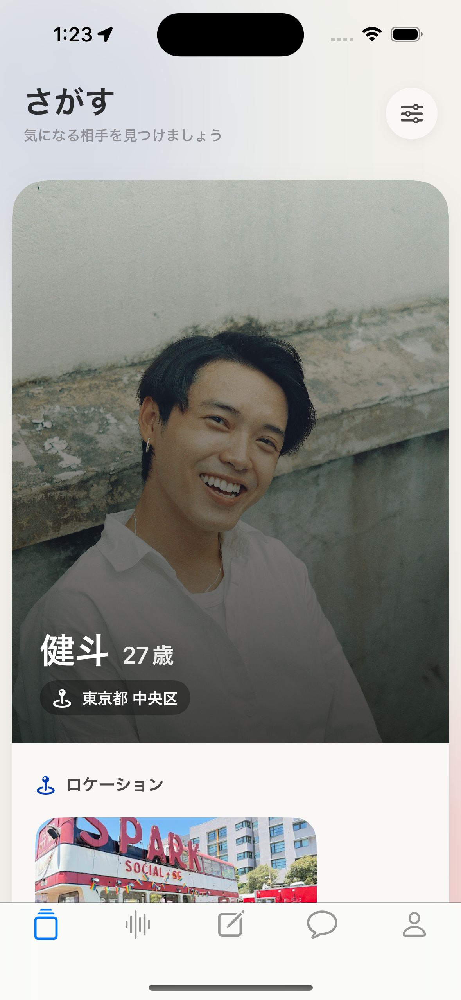
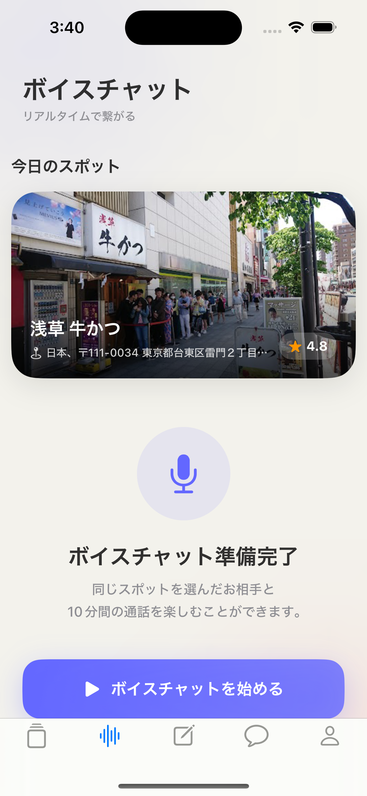
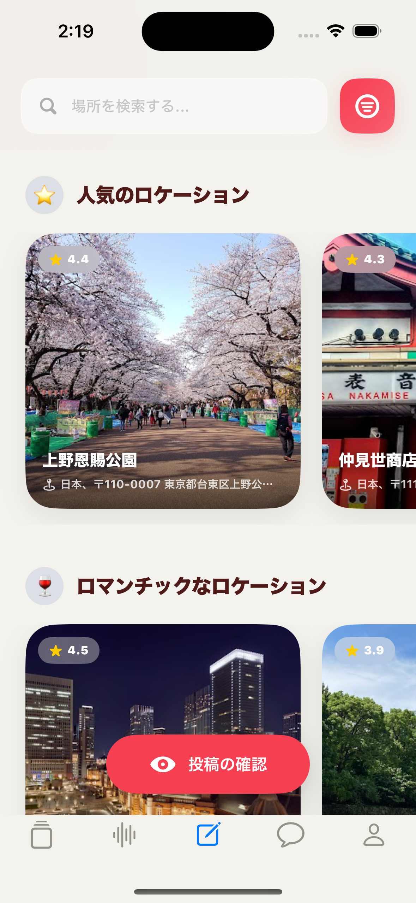

# はじめに

このリポジトリはポートフォリオ公開用として作成したものです。実際の開発は別リポジトリ（非公開）にて行っていました。

---

# 概要

**Rapid** は、「行きたい」スポットを投稿することでマッチングが生まれる、新しいコンセプトの出会い系サービスです。

既存のマッチングサービスよりも気軽に・素早く出会いを実現したいという思いから、このアプリ名にしました。ロゴは頭文字の「R」と、アプリ名の発音が "rabbit" に近いことからヒントを得て、うさぎの横顔をモチーフにデザインしています。

---

# Rapidについて

Rapidは、自分が「行きたい」と思えるスポットをプロフィールと一緒に投稿する形式で、理想の相手を探すマッチングアプリです。スポットという共通の話題を起点にすることで、これまでのマッチングアプリとは一味違った、自然な出会いの体験を提供します。

---

## 特徴的な機能

### 1. スポット付き募集機能

従来のマッチングアプリでは、プロフィールを作成するだけでタイムライン（TL）に表示され、特定のユーザーへのいいね集中や、サブスク料金に見合わない体験といった問題が生じがちです。

Rapidではこの構造的な問題に着目し、**プロフィールの作成だけではTLに表示されない**設計を採用しました。スポットを投稿して初めて他のユーザーの目に届く仕組みにすることで、アクティブで主体的なユーザーのみがTLに並ぶようになっています。

また、マッチングが成立した時点でその募集投稿はTLから自動削除されます。これにより、マッチング済みのユーザーへのいいねが集中する事態を防ぎ、より多くのユーザーが平等に出会いのチャンスを得られる構造を実現しています。

---

### 2. 1日1回限定のボイスチャット機能

毎日19:00から利用できる時間限定のボイスチャット機能です。

開始時刻になるとシステムが4つのスポットを提示し、ユーザーはその中から気になる場所を1つ選択します。同じスポットを選んだユーザーの中からランダムにペアが組まれ、10分間のボイスチャットを楽しむことができます。

通話後、お互いに好印象であれば「いいね」を送り合うことでマッチングが成立し、その後は個別のメッセージでやり取りを続けることができます。

---

### 3. スポット検索機能

募集投稿に使うスポットを探すための検索機能です。現在地周辺のスポットを手軽に探せるほか、キーワードによる検索にも対応しています。この機能を実現するにあたってはGoogle Places APIを利用しています。

## 技術スタック

### iosサイド
ios開発にあたって利用した技術スタックは次のとおりです。

1. **アプリケーション層**
    - 開発言語: Swift
    - UIフレームワーク: SwiftUI
    - アーキテクチャ: MVVM
    - 非同期処理・リアクティブ: async / await および、Combineを利用してUI状態を管理

2. **バックエンド・インフラ基盤**
    - Supabase
        - 認証
        - データベース（PostgresSQL, PostgREST）
        - ストレージ
        - リアリタイム通信
    - マイクロサービス連携: AWSのEC2インスタンスを利用して、同時のバックエンドサーバーを構築および、REST APIを独自実装

3. **マネタイズ・決済**
    - アプリ内課金・サブスク機能: RevenuCatを利用してApp Storeとの連携による決済機能を実装

4. **主要なサードパーティライブラリ**
    - SDWebImage: プロフィール画像などの大容量メディアの非同期ダウンロード・メモリキャッシュ処理
    - Lottie: アニメーション実装
    - TUSプロトコル通信: 本人確認書類や個人チャットの際の画像転送処理に利用
    - Google Places API: スポット検索・ロケーション情報連携
    - GoogleWebRTC: ボイスチャットなどのリアルタイムコミュニケーションを実現するために利用
    - GoogleMlKit: クライアントサイドで本人確認画像の正確な検出のために利用。

### バックエンドサイド

#### メインAPIプロキシ・ミドルウェア
- **言語・フレームワーク**: Rust, Actix-Web, Tokio
- **役割**: BaaS（Supabase）だけではカバーしきれないバックエンド処理（非同期タスク、決済フック監視、外部AI連携・審査、AWSとの同期、Geo空間演算）を全て担うBFF（Backends For Frontends）兼ビジネスロジックサーバー。
- **データベース・通信**:
  - `sqlx` を用いた非同期PostgreSQL接続と、PostgRESTクライアントによるREST経由のデータアクセスを併用。
  - 外部APIとの通信には `reqwest` を利用し、リトライ付きのHTTPリクエストを実装。
- **クラウド連携 (AWS)**:
  - S3（ストレージ）、SNS（プッシュ通知等）、EventBridge Scheduler（一定時間後の募集の自動終了などスケジューリング処理）とSDK連携。
- **主なドメインロジック**:
  - 位置情報（Geo）と連動した「募集機能」の空間演算
  - Google Cloud Vision API等と連携した、本人確認書類・顔写真の妥当性審査
  - 外部NLP等を利用したテキスト・コンテンツの監視とフィルタリング
  - JWTによるトークン検証、Redisを用いたデータキャッシュ・ステータス管理

#### アーキテクチャ
バックエンドサイドのアーキテクチャは次のような構成で設計しました。

